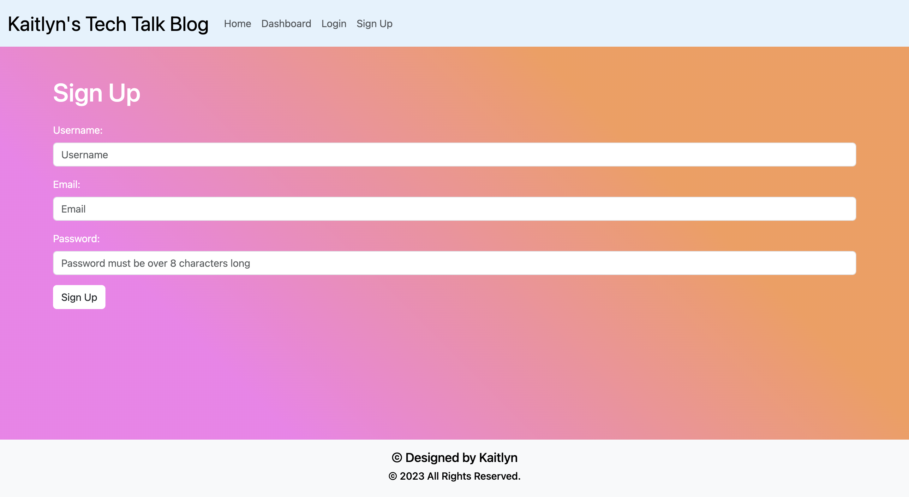
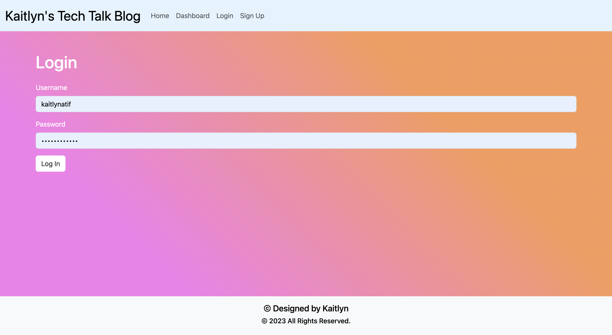
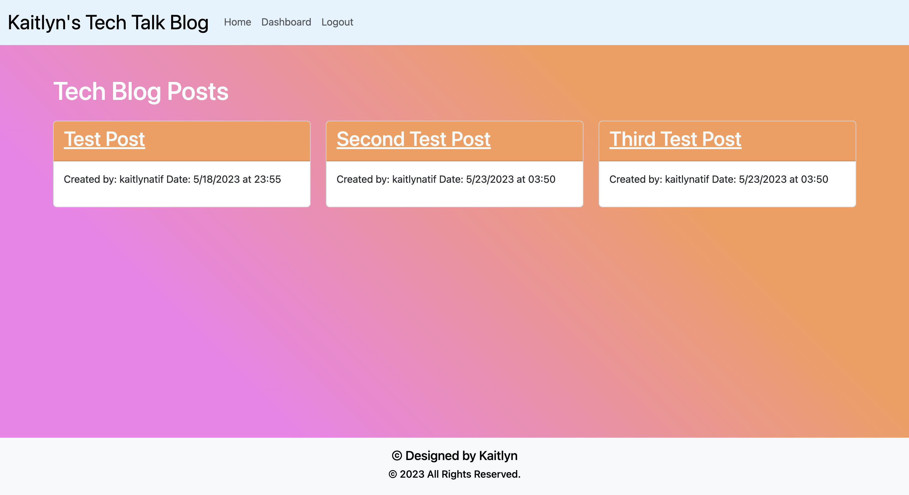
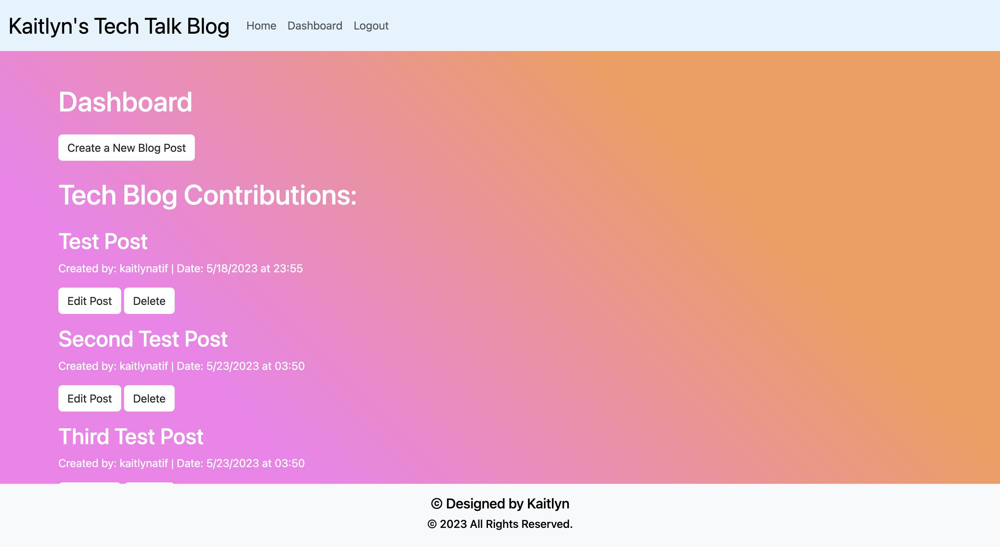
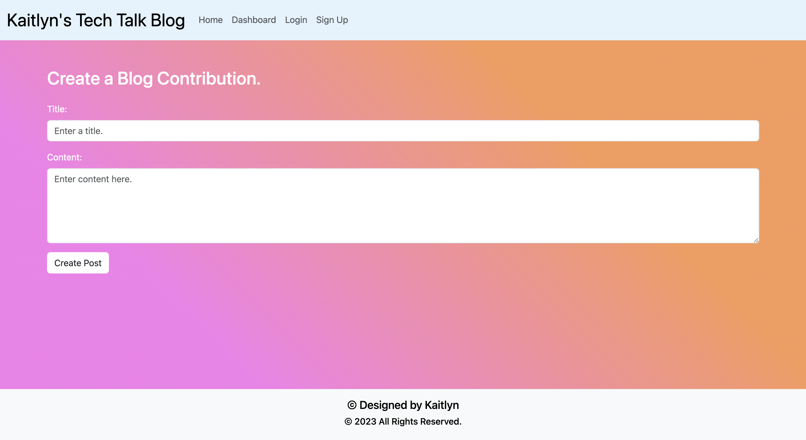

# Model-View-Controller (MVC): Tech Blog
[](https://opensource.org/licenses/MIT)

## Table of Contents:
- [Description](#Description)
- [User Story](#User-Story)
- [Acceptance Criteria](#Acceptance-Criteria)
- [Installation](#Installation)
- [Usage](#Usage)
- [Mock-Up](#Mock-Up)
- [Built With](#Built-With)
- [License](#License)
- [Author](#Author)

## Description

Writing about tech can be just as important as making it. Developers spend plenty of time creating new applications and debugging existing code bases, but most developers also spend at least some of their time reading and writing about technical concepts, recent advancements, and new technologies. A simple Google search for any concept covered in this course returns thousands of think pieces and tutorials from developers of all skill levels!

The task is to build a CMS-style blog site similar to a Wordpress site, where developers can publish their blog posts and comment on other developers’ posts as well. This site is built completely from scratch and deployed to Heroku. The app follows the MVC paradigm in its architectural structure, using Handlebars.js as the templating language, Sequelize as the ORM, and the express-session npm package for authentication.

## User Story

```md
AS A developer who writes about tech
I WANT a CMS-style blog site
SO THAT I can publish articles, blog posts, and my thoughts and opinions
```

## Acceptance Criteria

```md
GIVEN a CMS-style blog site
WHEN I visit the site for the first time
THEN I am presented with the homepage, which includes existing blog posts if any have been posted; navigation links for the homepage and the dashboard; and the option to log in
WHEN I click on the homepage option
THEN I am taken to the homepage
WHEN I click on any other links in the navigation
THEN I am prompted to either sign up or sign in
WHEN I choose to sign up
THEN I am prompted to create a username and password
WHEN I click on the sign-up button
THEN my user credentials are saved and I am logged into the site
WHEN I revisit the site at a later time and choose to sign in
THEN I am prompted to enter my username and password
WHEN I am signed in to the site
THEN I see navigation links for the homepage, the dashboard, and the option to log out
WHEN I click on the homepage option in the navigation
THEN I am taken to the homepage and presented with existing blog posts that include the post title and the date created
WHEN I click on an existing blog post
THEN I am presented with the post title, contents, post creator’s username, and date created for that post and have the option to leave a comment
WHEN I enter a comment and click on the submit button while signed in
THEN the comment is saved and the post is updated to display the comment, the comment creator’s username, and the date created
WHEN I click on the dashboard option in the navigation
THEN I am taken to the dashboard and presented with any blog posts I have already created and the option to add a new blog post
WHEN I click on the button to add a new blog post
THEN I am prompted to enter both a title and contents for my blog post
WHEN I click on the button to create a new blog post
THEN the title and contents of my post are saved and I am taken back to an updated dashboard with my new blog post
WHEN I click on one of my existing posts in the dashboard
THEN I am able to delete or update my post and taken back to an updated dashboard
WHEN I click on the logout option in the navigation
THEN I am signed out of the site
WHEN I am idle on the site for more than a set time
THEN I am able to view comments but I am prompted to log in again before I can add, update, or delete comments
```

## Installation
1. Clone the Repository from GitHub 
(or) Download Zip Folder from Repository from GitHub
2. Open the cloned (or downloaded) repository in any source code editor.

## Usage:

#### Visit the homepage, "Login" or "Sign Up" for an account if you don't already have one.

1. Option: A) Account login: click on "login" in the navigation menu - enter Username and Password then click "Sign In" to proceed.
- Option: B) Account Sign Up: click on "Sign Up" in the navigation menu - once open, enter Username, Email and Password then click "Sign Up" to proceed.
2. Once you have an account, you can create blog posts and comment on other users' posts.
3. Create a blog post: click on the "dashboard" option in the navigation menu and select "Create a New Blog Post."
4. Enter a title and contents for your Chess Blog Contribution, then click "Create Post" to save and publish.
5. View existing blog posts by clicking on "Home" in the navigation menu.
6. Comment: to view or "add a new comment" go to any blog post, click on any blog post - once open, you may view the comment history as well as add a new comments.
7. Edit or delete your blog post: click on the "dashboard" option in the navigation menu and select the post you wish to edit or delete.
8. Account Log out: click on "logout" in the navigation menu.

## Mock-Up

- URL of Deployed Application: [Tech Blog](https://obscure-beach-63742.herokuapp.com/)
- URL of GitHub Repository: [Tech Blog Repo](http://www.github.com/kaitlynatif/Tech_Blog)







## Built With:
- JSON:[ JSON](https://www.npmjs.com/package/json)
- Dynamic JavaScript
- Node.js [Version 16.18.1](https://nodejs.org/en/blog/release/v16.18.1/)
- Express.js:[Express.js](https://expressjs.com/en/starter/installing.html)
- Bcryptjs: [2.4.3](https://www.npmjs.com/package/bcryptjs)
- Connect Session Store using Sequelize: [7.0.4](https://www.npmjs.com/package/connect-session-sequelize)
- Dotenv: [8.6.0](https://www.npmjs.com/package/dotenv)
- Express: [4.17.1](https://www.npmjs.com/package/express)
- Express Handlebars: [5.2.0](https://www.npmjs.com/package/express-handlebars)
- Express-Session: [1.17.1](https://www.npmjs.com/package/express-session)
- Handlebars.js: [4.7.6](https://www.npmjs.com/package/handlebars)
- Node MySql2: [2.3.3](https://www.npmjs.com/package/mysql2)
- Sequelize: [6.29.3](https://www.npmjs.com/package/sequelize)
- License Badge: [Shields.io](https://shields.io/)
- Visual Studio Code: [Website](https://code.visualstudio.com/)

## Getting Started

Your application’s folder structure must follow the Model-View-Controller paradigm. You’ll need to use the [express-handlebars](https://www.npmjs.com/package/express-handlebars) package to implement Handlebars.js for your Views, use the [MySQL2](https://www.npmjs.com/package/mysql2) and [Sequelize](https://www.npmjs.com/package/sequelize) packages to connect to a MySQL database for your Models, and create an Express.js API for your Controllers.

You’ll also need the [dotenv package](https://www.npmjs.com/package/dotenv) to use environment variables, the [bcrypt package](https://www.npmjs.com/package/bcrypt) to hash passwords, and the [express-session](https://www.npmjs.com/package/express-session) and [connect-session-sequelize](https://www.npmjs.com/package/connect-session-sequelize) packages to add authentication.

**Note**: The [express-session](https://www.npmjs.com/package/express-session) package stores the session data on the client in a cookie. When you are idle on the site for more than a set time, the cookie will expire and you will be required to log in again to start a new session. This is the default behavior and you do not have to do anything to your application other than implement the npm package.

## License
  
[](https://opensource.org/licenses/MIT) [Open Source Initiative Link](https://opensource.org/licenses/MIT)

### Copyright © 2023 Kaitlyn Atif
```md
Permission is hereby granted, free of charge, to any person obtaining a copy
of this software and associated documentation files (the "Software"), to deal
in the Software without restriction, including without limitation the rights
to use, copy, modify, merge, publish, distribute, sublicense, and/or sell
copies of the Software, and to permit persons to whom the Software is
furnished to do so, subject to the following conditions:

The above copyright notice and this permission notice shall be included in all
copies or substantial portions of the Software.

THE SOFTWARE IS PROVIDED "AS IS", WITHOUT WARRANTY OF ANY KIND, EXPRESS OR
IMPLIED, INCLUDING BUT NOT LIMITED TO THE WARRANTIES OF MERCHANTABILITY,
FITNESS FOR A PARTICULAR PURPOSE AND NONINFRINGEMENT. IN NO EVENT SHALL THE
AUTHORS OR COPYRIGHT HOLDERS BE LIABLE FOR ANY CLAIM, DAMAGES OR OTHER
LIABILITY, WHETHER IN AN ACTION OF CONTRACT, TORT OR OTHERWISE, ARISING FROM,
OUT OF OR IN CONNECTION WITH THE SOFTWARE OR THE USE OR OTHER DEALINGS IN THE
SOFTWARE.
```

## Author

Follow me on Github at [Kaitlyn Atif](https://github.com/kaitlynatif). Additional questions or concerns? Please feel free to contact me at kaitlynatif90@hotmail.com.

© 2023 [Kaitlyn Atif](https://github.com/kaitlynatif). Confidential and Proprietary. All Rights Reserved.